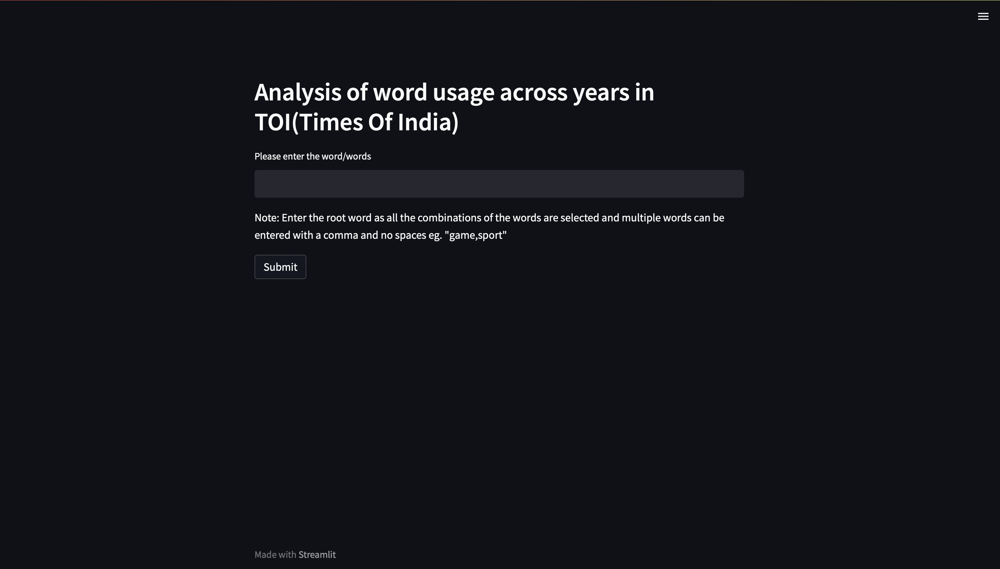

# News_Analysis-

The project involves scraping through the archives of Times of India from 2002 to 2022 and analyzing the frequency of words used across these years. The aim of the project is to provide insights into the changing trends and patterns of language usage in the newspaper over the past two decades.

The analysis involves processing and cleaning the data, identifying the words of interest, and counting their occurrences across each year. The results are then plotted on a graph to visualize the trends over time.

The project is insightful and useful in several ways. Firstly, it provides a historical perspective on the language usage in one of India's leading newspapers. This information can be useful for researchers, journalists, and language enthusiasts who want to understand the evolution of language over time.

Secondly, the project can help identify the topics and issues that were prominent in different years. By analyzing the frequency of words related to specific topics, one can gain insights into the social, political, and economic trends of the time.

Overall, this project can serve as a valuable resource for anyone interested in studying the language and content of Indian newspapers and the changing trends over the past two decades.

